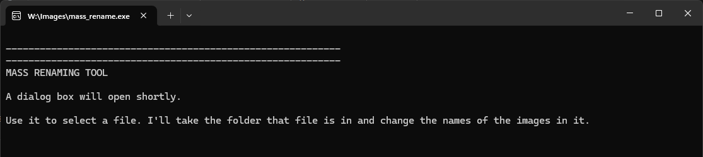

# Mass Rename Images
## Purpose

Allows you to rename all and only the image and video files in a folder at once.

The file extensions recognised as belonging to image or video files are found in `extensions.py`.

All the files are assigned numbers plus your chosen text. Numbers start again if multiple valid file types are found.

For example, if your chosen text was "Our Wedding", the files would be renamed:

- `01_our_wedding.jpg`
- `02_our_wedding.jpg`
- `03_our_wedding.jpg`
- ... etc

- `01_our_wedding.png`
- ... etc

The script ignores sub-folders and any files within those sub-folders.

## Caveat

There is no built-in way to undo actions performed with this script. Use it at your own risk. Back-up important files. We take no responsibility for any lost or corrupted files!

## Download 

Get the latest release: https://github.com/wadham-oxford/mass_rename/releases

## How To Use

After running the script, a command line window will open with a brief message:

After a short pause, a dialog box will open asking you to select a file. 

IMAGE

Browse to the folder where you want file names to be changed and select any file in that folder. It doesn't matter which one. The file is just being used to point the script to the folder you want to work with.

Once you have selected a file, the dialog box will close. 

Return to the command line window, where you will be asked to type in the new name you want to give to your image/video files.

IMAGE

Hit enter when you have typed the name. There may be a few moments pause while the script works to update the file names.

Once that work is complete, the script will open the folder for you in your file browser so you can see the changes. 

To work on another folder, return to the command line window and hit enter.

IMAGE

To terminate the script, close the command line window or hit CTRL + C. 